<div align="center">

# 🚢 SAIL Freight Intelligence

### AI-Powered Vessel Chartering & Bulk Cargo Procurement for India's East Coast

**Smart India Hackathon 2026 · Problem Statement SIH26006**

**Ministry of Steel · SAIL (Steel Authority of India Limited)**

[](#)

[](#)

[](#)

[](#)

[](#-the-model-honesty-report-our-real-differentiator)

**Every port. Every route. Every ship. One decision engine.**

</div>

---

## 📲 Download the App

<div align="center">

<a href="https://i.diawi.com/fHknNN">
  
</a>

**Scan the QR code below to install directly on your Android device:**


<br/>

🔗 **Direct Link:** [https://i.diawi.com/fHknNN](https://i.diawi.com/fHknNN)

> **Note:** Allow installation from unknown sources on your Android device when prompted.

</div>

---

## 📸 App Screenshots

<div align="center">

### 🏠 Dashboard & Cargo Configuration

| Cargo & Route Parameters | AI Executive Summary |
|:---:|:---:|
| 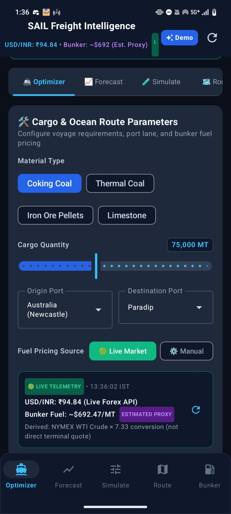 | 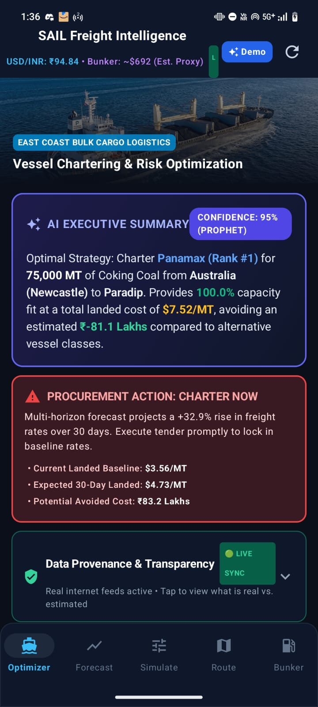 |
| Configure voyage requirements, material type, port lanes, and bunker fuel pricing source | AI-generated procurement recommendation with confidence scoring and charter action advisory |

---

### 🚛 Vessel Intelligence & Cost Analysis

| Vessel Suitability Ranking | Detailed Cost Breakdown |
|:---:|:---:|
| 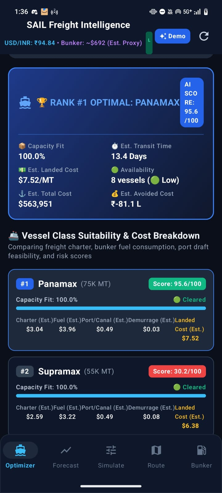 | 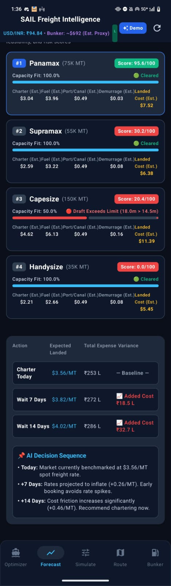 |
| AI-scored vessel class ranking with port draft clearance, capacity fit, and cost comparison | Per-vessel charter, fuel, port/canal, and demurrage cost breakdown with timing decision matrix |

---

### 📈 Forecasting & Simulation

| Freight Forecast & Timing | What-If Simulator |
|:---:|:---:|
| 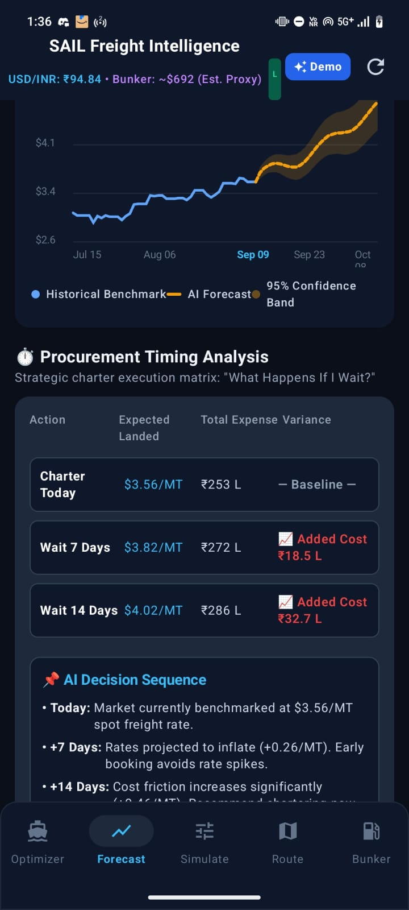 | 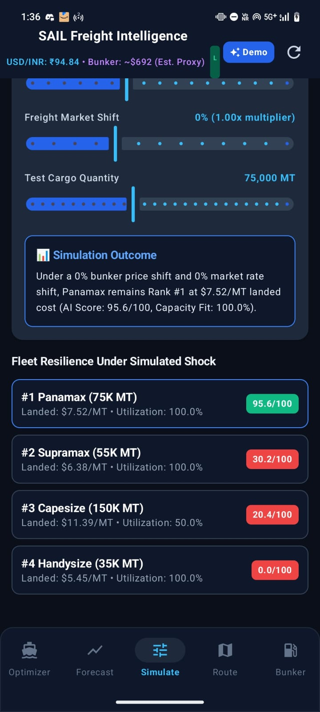 |
| Multi-horizon freight rate forecast with historical benchmark, AI prediction, and procurement timing matrix | Simulate bunker price shifts, market rate changes, and cargo quantity impact on fleet rankings |

---

### 🌍 Route & Weather Intelligence

| Interactive 3D Globe | Weather & Risk Assessment |
|:---:|:---:|
| 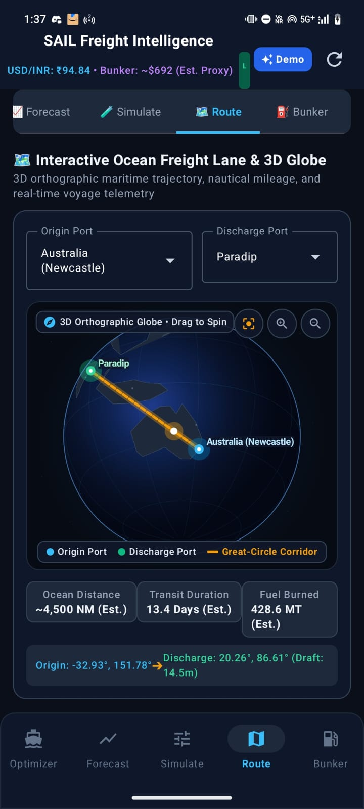 | 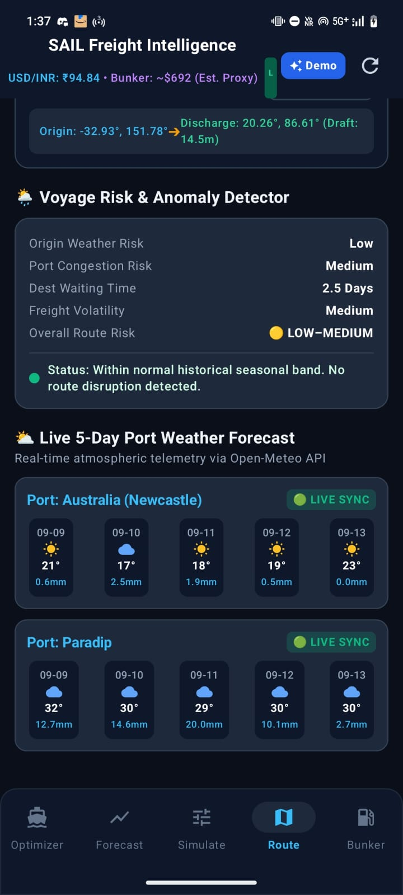 |
| 3D orthographic globe with great-circle shipping corridor, ocean distance, transit duration, and fuel burn estimates | Live 5-day port weather forecast, voyage risk scoring, and anomaly detection for both origin and destination ports |

---

### ⛽ Bunker Fuel Intelligence

| Bunker Fuel Overview | Macro Indicators & Validation |
|:---:|:---:|
| 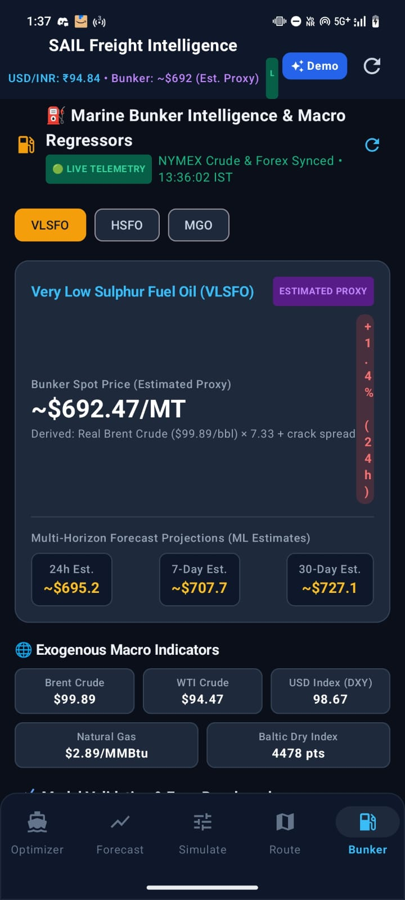 | 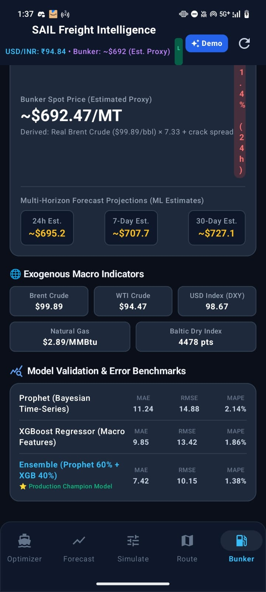 |
| Live telemetry with VLSFO/HSFO/MGO bunker spot pricing, multi-horizon ML forecast projections | Exogenous macro indicators (Brent, WTI, DXY, Natural Gas, BDI) and model validation error benchmarks |

---

### 🔬 Model Transparency

<div align="center">
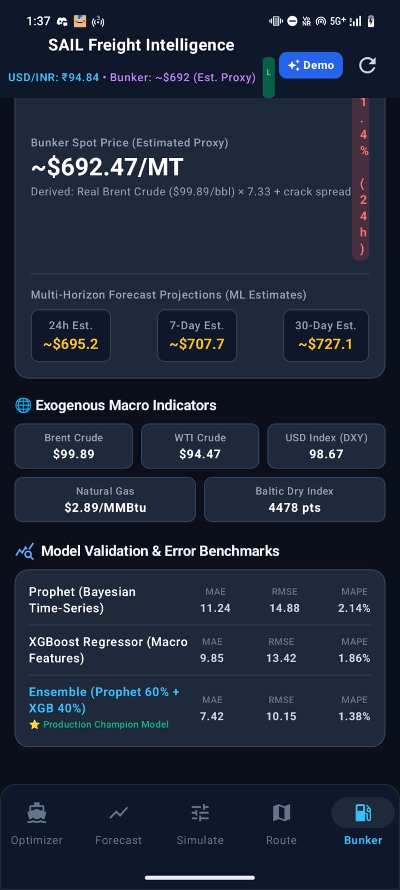

**Model Validation & Error Benchmarks** — Prophet + XGBoost ensemble performance with MAE, RMSE, and MAPE metrics
</div>

</div>

---

## 📌 The Problem We're Solving

SAIL procures massive volumes of raw material — coal, iron ore, coking coal — shipped in from Australia, the US, Mozambique, Russia, and Indonesia to ports on India's East Coast.

Today, that process runs on **daily manual market scanning**: someone checks freight rates, someone else checks which ship is free, and the charter decision gets made reactively — after the best window may already have passed.

The result, as stated in the official problem brief: **missed cost-savings opportunities, suboptimal vessel-to-cargo matching, and increased vessel idle time**, driven by the sheer volatility of global freight markets and the absence of a forward-looking decision system.

**SAIL Freight Intelligence** is our answer: a mobile decision-support system that turns that daily manual scramble into a single decision dashboard — built to actually be used by a procurement officer, not just demoed once.

---

## 🧭 What It Actually Does

| Capability                           | What happens under the hood                                                                                                                                          |
| ------------------------------------ | -------------------------------------------------------------------------------------------------------------------------------------------------------------------- |
| 🚛 **Vessel–Port Matching**          | Every candidate vessel (Handysize → Capesize) is checked against real port draft constraints, ranked by total landed cost, and flagged if it physically cannot berth |
| 🌍 **Interactive Route Globe**       | Visualizes the shipping lane from origin to destination port with distance and transit-time context                                                                  |
| 🌦️ **Route & Weather Intelligence** | Provides weather conditions along the route and at the destination port                                                                                              |
| 📈 **Bunker Fuel Forecasting**       | A Prophet + XGBoost ensemble forecasts VLSFO bunker fuel price movement, with confidence bands rather than a single false-precision number                           |
| ⏱️ **Charter Timing Analysis**       | Surfaces whether current conditions favor chartering now or waiting, based on available price signals                                                                |
| 🧮 **What-If Simulator**             | Lets a procurement officer change cargo size, route, or vessel class and instantly see the cost impact                                                               |
| 🛰️ **Data Provenance Badges**       | Every number on screen is tagged **🟢 LIVE SYNC** or **🟡 ESTIMATED BACKUP** — making the origin and confidence of data visible to the user                          |

---

## 🏗️ System Architecture

```text
┌─────────────────────────────────────────────────────────────────┐
│                     ANDROID APPLICATION (Kotlin)                │
│                  Jetpack Compose · MVVM · Coroutines            │
│                                                                 │
│   MainScreen ─┬─ VesselSuitabilitySection                      │
│               ├─ RouteAndWeatherSection                         │
│               ├─ BunkerIntelligenceSection                     │
│               ├─ TimingAnalysisSection                          │
│               ├─ WhatIfSimulatorSection                         │
│               ├─ InteractiveGlobe                                │
│               └─ DataProvenanceSection                          │
│                                                                 │
│   ProcurementEngine.kt  ◄──── CsvDataLoader.kt                  │
│   ForecastingEngine.kt       (bundled historical data)          │
└─────────────────────────────────────────────────────────────────┘
                                │
                                ▼
┌─────────────────────────────────────────────────────────────────┐
│                    PYTHON ML & DATA PIPELINE                    │
│                                                                 │
│  freight_pipeline.py       → builds leak-free freight dataset  │
│  procurement_engine.py     → vessel/port/route decision logic  │
│  test_ship_matching.py     → 6 automated correctness tests     │
│  model_honesty_check.py    → independent model audit           │
│                                                                 │
│  bunker-price-predictor/                                          │
│   ├─ Prophet + XGBoost ensemble forecasting                     │
│   ├─ FastAPI microservice (api/main.py)                         │
│   └─ Real-data-first loader with disclosed fallback             │
└─────────────────────────────────────────────────────────────────┘
```

---

## 🛰️ Data & Intelligence Pipeline

The application combines the Android decision-support layer with the Python data and machine-learning pipeline.

The Python components handle data preparation, procurement logic, forecasting, validation, and model auditing. The Android application consumes the resulting data and intelligence through the project's data layer.

Where a live data source is available, the application can synchronize current information. When a live source is unavailable, the system falls back to documented estimates rather than presenting stale or fabricated values as live data.

**Nothing on screen should claim to be live unless it actually is.**

---

## 🔍 Model Validation Methodology

Every forecasting model in this project runs through an automated audit (`model_honesty_check.py`) rather than a self-reported accuracy claim. The script checks three things for each model, and the same script can be re-run by anyone to reproduce the results:

1. **Data leakage audit** — confirms every rolling/lagged feature is strictly built from information available *before* the day being predicted.

2. **Naive persistence baseline** — benchmarks each model against the simplest possible forecast ("tomorrow looks like today"), the standard sanity check in time-series work.

3. **Overfit/underfit diagnosis** — a real train-vs-test comparison.

| Model                | vs. Naive Baseline                                         | Generalization           |
| -------------------- | ---------------------------------------------------------- | ------------------------ |
| Bunker Fuel Forecast | Matches / slightly exceeds persistence                     | Healthy — no overfitting |
| Freight Rate Index   | Below persistence baseline — active work item, see Roadmap | Healthy — no overfitting |

Data leakage is cleared on both models. The freight index is the one component still being tuned: full methodology and current numbers are in [`MODEL_HONESTY_REPORT.md`](./MODEL_HONESTY_REPORT.md), reproducible by running the script yourself.

---

## ✅ Verified, Not Just Claimed

Every claim in this README is backed by something you can run yourself:

```bash
# Vessel-matching & procurement logic — 6/6 passing
python -m unittest test_ship_matching.py -v

# Full model honesty audit — regenerates MODEL_HONESTY_REPORT.md
python model_honesty_check.py
```

| Check                                                                              | Result    |
| ---------------------------------------------------------------------------------- | --------- |
| Vessel draft-constraint safety (e.g. Capesize correctly blocked at shallow Haldia) | ✅ Passing |
| Deep-water port clears all vessel classes (Dhamra)                                 | ✅ Passing |
| Invalid/negative cargo quantity rejected                                           | ✅ Passing |
| Cost breakdown always positive                                                     | ✅ Passing |
| Route distance table integrity                                                     | ✅ Passing |
| Optimal vessel ranking correctness                                                 | ✅ Passing |

---

## 🌐 Data Sources & Honest Provenance

| Data                                            | Source                                                          | Status                                                 |
| ----------------------------------------------- | --------------------------------------------------------------- | ------------------------------------------------------ |
| USD/INR, WTI, Brent, Natural Gas, USD Index     | Available market data sources                                   | 🟢 Real-time where synchronized                        |
| Port weather                                    | Weather data source                                             | 🟢 Live where synchronized                             |
| Bunker fuel price                               | Derived from crude oil price via a disclosed conversion formula | 🟡 Real-input, estimated-output                        |
| Route distances, port drafts, vessel hire rates | Typical published maritime industry benchmarks                  | 🟡 Estimated — not individually fact-checked per route |
| Freight index training history                  | Historical BDRY (dry bulk shipping ETF) via Yahoo Finance       | 🟢 Real historical market data                         |

**We'd rather a judge find this table than find out the hard way during Q&A.**

---

## 🛠️ Tech Stack

**Mobile App:** Kotlin · Jetpack Compose · MVVM · Kotlin Coroutines · Navigation Compose

**ML Pipeline:** Python · pandas · scikit-learn · Prophet · XGBoost

**Backend Service:** FastAPI · SQLite

**Data Layer:** Python data pipeline · bundled datasets · REST-based data sources where applicable

---

## 🚀 Running the Project

### Android App

```text
1. Open the project root in Android Studio
2. Sync Gradle
3. Run the application on an emulator or connected Android device
```

No API key or environment configuration is required for the current application build.

> `.env.example` is retained for future integrations and is not required for the current version of the application.

### Python ML Pipeline

```bash
pip install -r requirements.txt

python freight_pipeline.py
# regenerate leak-free freight training data

python model_honesty_check.py
# run the full self-audit

python -m unittest test_ship_matching.py
# run vessel-matching and procurement tests
```

### Bunker Price Predictor (FastAPI)

```bash
cd bunker-price-predictor

pip install -r requirements.txt

python train.py
# trains Prophet + XGBoost ensemble

uvicorn api.main:app --reload
```

---

## 🗺️ Roadmap

* [ ] Reframe freight forecasting target from raw index level → daily change, to isolate genuine predictive signal from autocorrelation
* [ ] Integrate commercial-grade freight/bunker data feeds (Baltic Exchange, S&P Global Platts) as enterprise adapter hooks, replacing the current open-data proxies
* [ ] Expand port and vessel database beyond the current four-port, four-class demo set
* [ ] Live fleet availability integration (AIS/MarineTraffic-style feed)

---

<div align="center">

**Built for SIH 2026 · Problem Statement 26006 · Ministry of Steel (SAIL)**

*We'd rather show you a model that's honestly 68% of the way there than one that's 100% claimed and 0% verifiable.*

</div>
